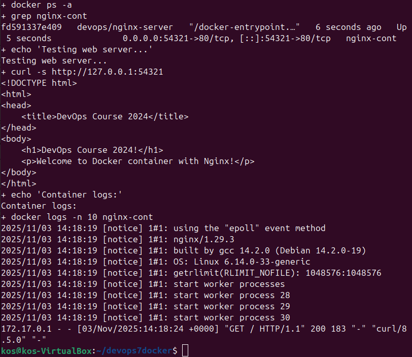
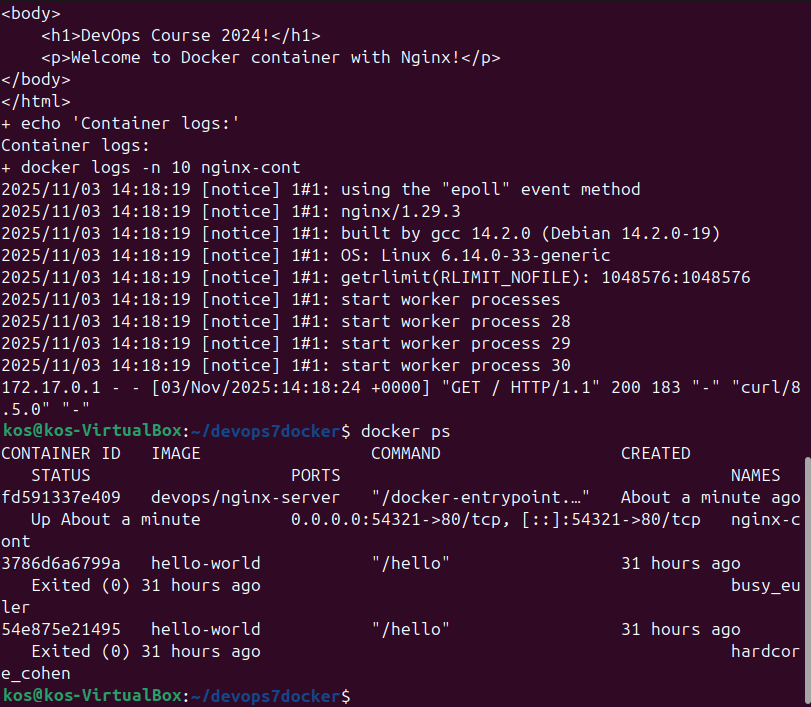
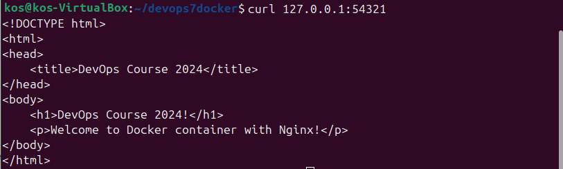
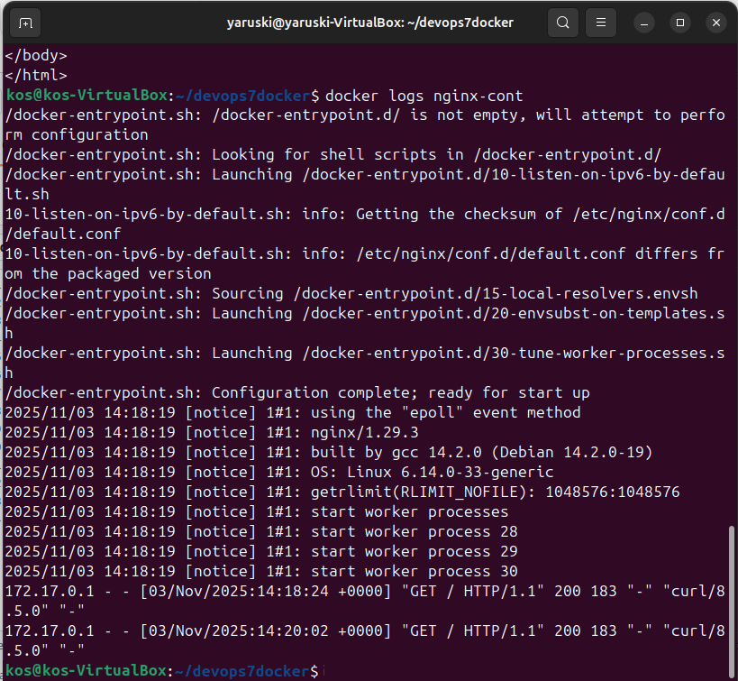

# DevOps-PO7
ПО7. Docker basics - практика

#**Проделанная работа**
1) Установлен Docker и пользователь добавлен в группу docker
2) Создана структура каталогов и файлы(index.html, nginx.conf, dockerfile)
3) Создан и протестирован скрипт развертывания

4) Проверены результаты работы

